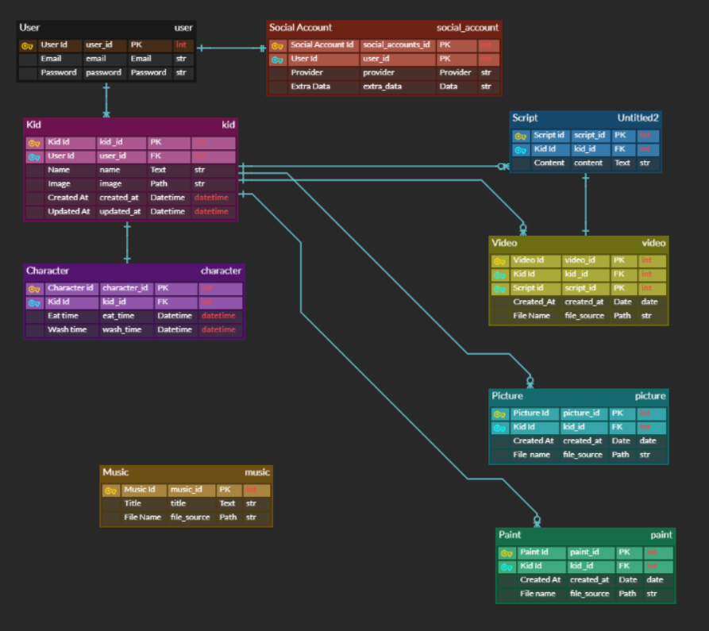
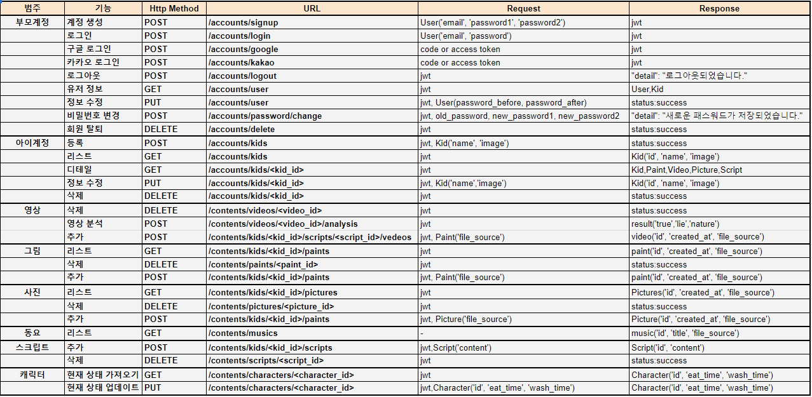

# Inside kids - 이모삼촌들

## 목차
- [개요](#개요)
- [팀원 소개](#팀원-소개)
- [사용법](#사용법)
- [기능](#기능)
- [기술 스택](#기술-스택)
- [기술 설명](#기술-설명)
	- [ERD](#erd)
	- [디렉토리 구조도](#디렉토리-구조도)
	- [기타](#기타)
- [테스트 방법](#테스트-방법)


## 개요
> AI 캐릭터를 통해 아이의 속마음을 들어보는 서비스 


## 팀원 소개


## 사용법

- Backend

  - 파이썬 패키지 설치

    ```bash
    pip install -r requirements.txt
    # 개발환경
    pip install -r requirements_local.txt
    ```

  - DB 모델링

    ```bash
    python manage.py makemigration
    python manage.py migrate
    ```
    
  - 실행
  
    ```bash
    python manage.py runserver
    ```
  
    
  
- Frontend

  - 디렉토리 이동

    ```bash
    cd frontend
    ```

  - 필요한 라이브러리 설치 및 실행

    ```bash
    npm install
    npm run serve
    ```

  - 빌드

    ```bash
    npm run build
    ```

    

## 기능

#### 주요 기능 (FOR 부모)

- 아이에게 물어볼 질문 등록

- 아이의 대화 영상 기록 확인

- 아이의 그림 확인 및 공유

- 아이의 사진 확인 및 공유

  

#### 부가 기능 (FOR 아이)

- 그림 그리기

- 사진 찍기

- 동요 부르기

  ##### 캐릭터 디자인

  


## 기술 스택


## 기술 설명

### ERD



https://www.erdcloud.com/d/Sp7M42wxDDvtge6pi


### 디렉토리 구조도

- 학습 : AI 학습
  - study : 프로젝트 수행을 위한 사전 학습 및 테스트
- 백엔드 : django
  - backend: django project 설정
  - accounts : 계정 관리 dajngo app
  - contents : 컨텐츠 관리 django app
  - contents/tts : 텍스트 음성 합성 처리 ai 모듈
  - contents/lie_detector: 눈동자의 움직임을 통한 거짓말 판단 ai  모듈
- 프론트엔드 : vue.js
  - frontend
- 배포
  - deployments: 배포 설정 파일 ( gunicorn, supervisor, nginx )


### 기타
##### 개발 환경

- OS : ubuntu 18.04

- Python : 3.7.x

  - 패키지 관리자 : PIP

- node JS :  12.x

  - 패키지 관리자 : npm

- IDE : vs code

- Lint

  vs code의 세이브 시 자동 정렬 기능을 활성화하여 코드의 통일성이 유지

  JS : ES Lint (vs code extention)

  Python : pep8
  
  


##### Git commit 정책 (Angular Git Commit Coventions 참조)

- Jira Key는 1 commit 당 1 key 원칙 (단, sub Task의 경우 복수 키 허용)
  
- Commit 형식

  `git commit -m '[<Tag>] <Message>, <Option> <Jira Key>'`

  ex) 

  `git commit -m '[Feat] signup with email instead of username, resolves S03P22B106-76`
  
- Tag

  - Feat(feature)
    새로운 내용 추가 즉, Jira Issue Task 수행과 직결되는 내용의 추가 시

  - Fix(bug fix)
    버그 수정

  - Docs(documentation)
    문서 추가, 문서 수정

  - Style(frommatiing, missing semi colons, ...)
    코드 포맷팅 등 코드 자체의 변경 없이 Style 변경만 있는 경우

  - Refactor(Refactor)
    코드 리펙토링, 기능은 변하지 않았지만 구조가 변한 경우

  - Test(when adding missing tests)
    테스트 내용 추가

  - Chore(maintain)
    코드 관리, 구조 변경 등의 이슈 발생 시

  - [임시]Study

    Ai 및 프로젝트에 필요한 신규 기술을 학습한 내용을 커밋할 시
    
  - Release

    배포를 위한 작업

- Message

  Message는 작업 내용을 요약하며 50자 이내로 간결하게 작성

- Option

  `resolves` 등 jira의 smart commit 기능을 사용할시

- Jira Key

  jira에 커밋 내용에 해당하는 이슈 키


##### API Documentation



https://docs.google.com/spreadsheets/d/13YrPIV2G8iPM4RlGT9UtUlvjRybJrfWg3j3Yb12O6ok/edit#gid=0


##### 테스트 결과

https://docs.google.com/spreadsheets/d/133PqrZhbj-TFiVM6CMsT_qQjCFjCstHZTXJhErsCuSQ/edit


## 테스트 방법
- url : https://j3b106.p.ssafy.io/

- TEST 계정
ID : pin954562@gmail.com
    PW : test1234!

