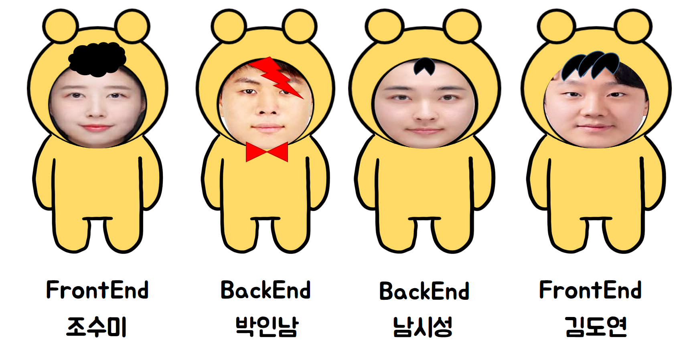
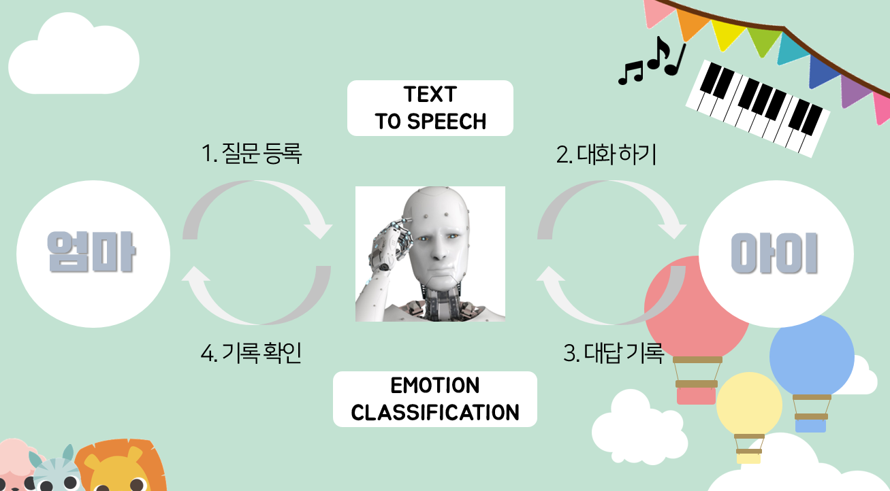
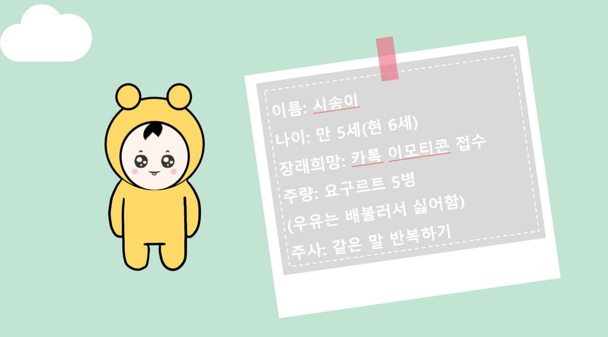
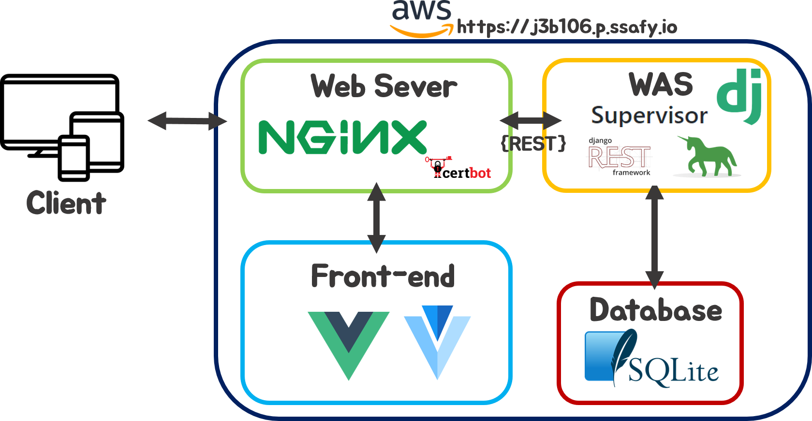
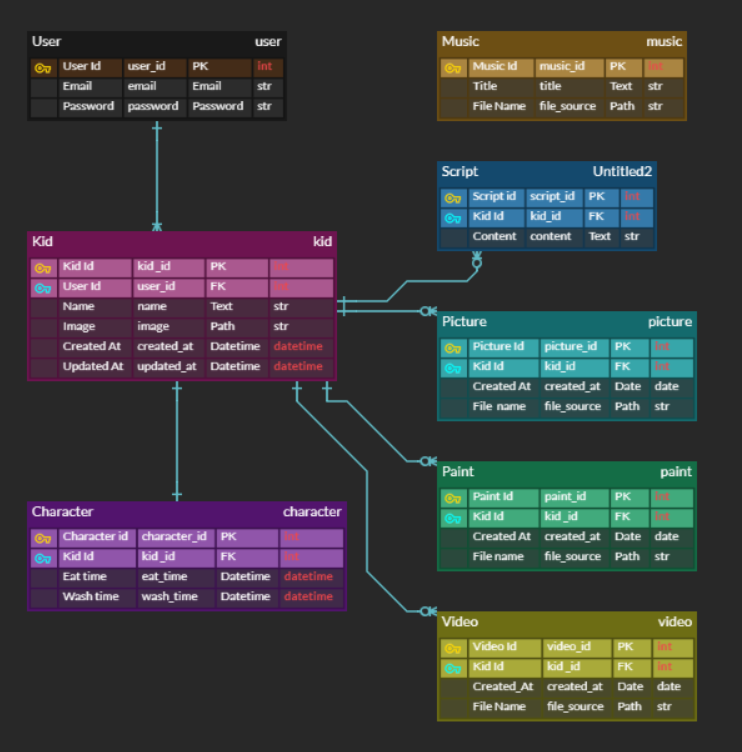

# Inside kids - 이모삼촌들

## 목차
- [sub3 1주차 진행정도](#sub3 1주차 진행정도)

- [개요](#개요)

- [팀원 소개](#팀원-소개)

- [기능](#기능)

- [향후 계획](#향후-계획)

- [기술 스택](#기술-스택)

- [기술 설명](#기술-설명)
	
	- [ERD](#erd)
	- [디렉토리 구조도](#디렉토리-구조도)
	- [기타](#기타)
	
- [테스트 방법](#테스트-방법)

## sub3 1주차 진행정도

### AI

- TTS - /tts , 스크립트로 저장한 텍스트를 tts 로 변환해 wav 파일로 저장가능
- 영상분석 - /Al/study/eye detection , 눈동자의 움직임으로 현재 상상력 기반으로 말하는지, 기억 기반으로 말하는지 구분

### 회원가입

- 회원가입, 로그인, 로그아웃 기능
- 아이 계정 복수 설정 가능
- 아이 계정 수정 가능

### 부모

- 아이가 캐릭터와 대화한 내용을 녹화한 영상 시청 및 관리 가능
- 캐릭터가 아이에게 질문 할 내용을 부모가 작성하고 관리 가능
- 아이 관리 페이지 구현 완료

### 아이

- 캐릭터 대화기능 개발 중
- 동요 부르기 개발 중
- 그림그리기 탭 사용가능
- 사진찍기 탭 사용가능
- 캐릭터 밥주기 및 씻기기 기능 가능

### 캐릭터

- 다양한 캐릭터 행동 제작 및 시각화 가능
- javascript 알고리즘을 통해 일정 시간이 지나면 캐릭터가 배고픔, 더러움, 잠자기 행동 시각화 가능

## 개요
> AI 캐릭터를 통해 아이의 속마음을 들어보는 서비스 

## 팀원 소개

## 기능

#### 주요 기능 (FOR 부모)

#### 부가 기능 (FOR 아이)

- 그림 그리기

- 사진 찍기

- 동요 부르기

  ##### 캐릭터 디자인

  

## 향후 계획

- AI를 웹에 적용(TTS, EMOTION CLASSIFICATION)

- 캐릭터 애니메이션 추가

- 아이를 위한 기능 구현(그림 그리기, 사진 찍기, 동요 부르기)

  

## 기술 스택

## 기술 설명

### ERD

### 디렉토리 구조도

- AI/ : AI 테스트

- backend/ : django설정

- accounts/, contents/ : django app

- frontend/ : vue.js 프로젝트

- deployments: 배포 설정 파일

### 기타
##### 개발 환경

- OS : ubuntu 18.04

- Python : 3.7.x

  - 패키지 관리자 : PIP

- node JS :  12.x

  - 패키지 관리자 : npm

- IDE : vs code

- Lint

  vs code의 세이브 시 자동 정렬 기능을 활성화하여 코드의 통일성이 유지

  JS : ES Lint (vs code extention)

  Python : pep8
  
  

##### Git commit 정책 (Angular Git Commit Coventions 참조)

- Jira Key는 1 commit 당 1 key 원칙 (단, sub Task의 경우 복수 키 허용)
  
- Commit 형식

  `git commit -m '[<Tag>] <Message>, <Option> <Jira Key>'`

  ex) 

  `git commit -m '[Feat] signup with email instead of username, resolves S03P22B106-76`
  
- Tag

  - Feat(feature)
    새로운 내용 추가 즉, Jira Issue Task 수행과 직결되는 내용의 추가 시

  - Fix(bug fix)
    버그 수정

  - Docs(documentation)
    문서 추가, 문서 수정

  - Style(frommatiing, missing semi colons, ...)
    코드 포맷팅 등 코드 자체의 변경 없이 Style 변경만 있는 경우

  - Refactor(Refactor)
    코드 리펙토링, 기능은 변하지 않았지만 구조가 변한 경우

  - Test(when adding missing tests)
    테스트 내용 추가

  - Chore(maintain)
    코드 관리, 구조 변경 등의 이슈 발생 시

  - [임시]Study

    Ai 및 프로젝트에 필요한 신규 기술을 학습한 내용을 커밋할 시

- Message

  Message는 작업 내용을 요약하며 50자 이내로 간결하게 작성

- Option

  `resolves` 등 jira의 smart commit 기능을 사용할시

- Jira Key

  jira에 커밋 내용에 해당하는 이슈 키

##### API Documentation

https://docs.google.com/spreadsheets/d/13YrPIV2G8iPM4RlGT9UtUlvjRybJrfWg3j3Yb12O6ok/edit#gid=0

## 테스트 방법
- url : http://j3b106.p.ssafy.io/   ~~http://inside-kids.cf~~ (준비중)

- TEST 계정 (준비중)

